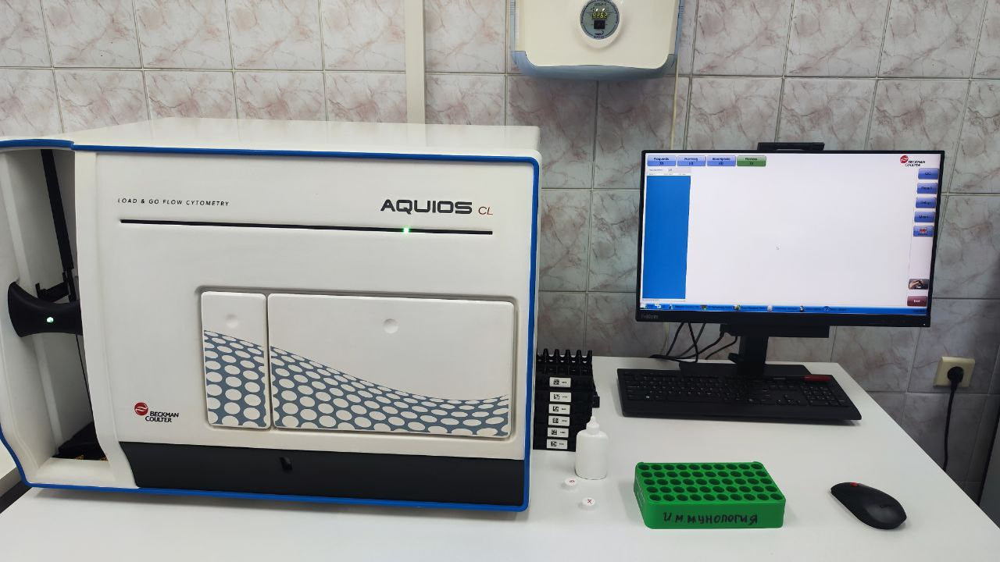
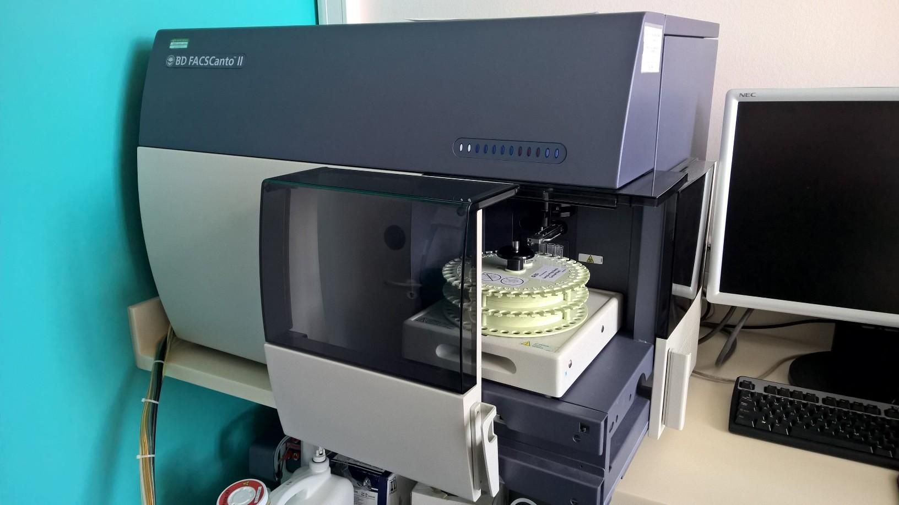

# ФИО
Ерёмина Ксения Валерьевна

## Место работы
Клинико - диагностическая лаборатория 

### Навыки:
1. Проведение  исследований  на  автоматическом анализаторе BECKMAN COULTER AQUIOS Cl

2. Проведение  исследований  на  автоматическом анализаторе BD FACS Canto II

3.   Проведение  исследований методами иммуноферментной диагностики 